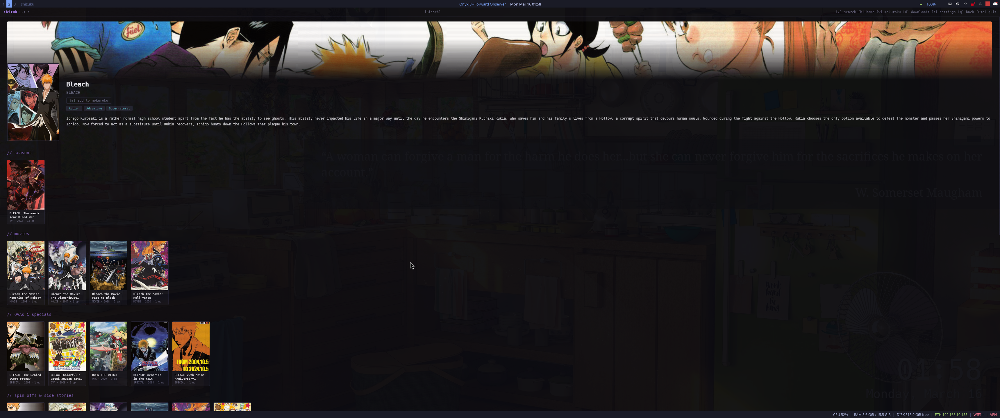
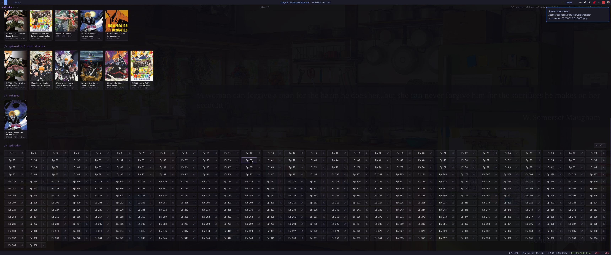

# shizuku

A personal anime streaming and management desktop app with a terminal-inspired aesthetic. Built with Tauri v2, vanilla JS, and Rust.

## Features

- **Browse & Search** — trending, recently updated, and genre-based browsing powered by AniList
- **Stream** — watch episodes directly in-app with automatic source cycling and mpv fallback
- **Download** — single episodes or entire seasons (barrels) with organized folder structure
- **Mokuroku** — personal watchlist for tracking anime you want to watch
- **Continue Watching** — pick up where you left off from the home screen
- **Auto-play Next** — seamlessly plays the next episode when the current one ends
- **Watched Markers** — visual indicators on episodes you've already seen
- **Keyboard-driven** — full keyboard navigation: `/ search` `h home` `w mokuroku` `d downloads` `s settings` `q back` `Esc quit`

## Screenshots






## Installation

Download the latest release for your platform:

- `.deb` — Debian/Ubuntu
- `.rpm` — Fedora/RHEL
- `.AppImage` — Universal Linux

Releases are available on the [releases page](https://github.com/onyxdigitaldev/projectshizuku/releases).

### Optional Dependencies

- **mpv** — fallback video player for streams that can't play in the embedded player
- **yt-dlp** or **ffmpeg** — required for downloading m3u8/HLS streams

## Building from Source

Requires [Rust](https://rustup.rs/), [Node.js](https://nodejs.org/), and the [Tauri CLI](https://v2.tauri.app/start/prerequisites/).

```bash
git clone https://github.com/onyxdigitaldev/projectshizuku.git
cd projectshizuku
npm install
npm run tauri build
```

Bundles output to `src-tauri/target/release/bundle/`.

## Architecture

| Layer | Tech | Purpose |
|-------|------|---------|
| Frontend | Vanilla JS, HTML, CSS | UI rendering, keyboard navigation, video playback |
| Backend | Rust + Tauri v2 | API calls, downloads, database, system integration |
| Database | SQLite (rusqlite) | Watch history, downloads, watchlist, settings, cache |
| Metadata | AniList GraphQL API | Anime info, search, trending, genres, relations |
| Streaming | AllAnime API | Episode sources, video URLs |

## Credits & Acknowledgments

- **[ani-cli](https://github.com/pystardust/ani-cli)** — the AllAnime provider integration, including the hex cipher decoding approach for obfuscated source URLs, is inspired by ani-cli's work in reverse-engineering the AllAnime API. Shizuku would not exist without their trailblazing effort.
- **[AniList](https://anilist.co)** — anime metadata, search, trending, and genre data via their public GraphQL API.
- **[AllAnime](https://allmanga.to)** — streaming source provider.
- **[Tauri](https://tauri.app)** — the desktop application framework that makes this possible.
- **[JetBrains Mono](https://www.jetbrains.com/mono/)** — the monospace typeface used throughout the UI.

### Rust Crates

`tauri` `reqwest` `tokio` `rusqlite` `serde` `serde_json` `anyhow` `chrono` `dirs` `futures-util`

## Disclaimer

This software is provided as-is for personal, non-commercial use only. It is not for sale, redistribution, or commercial deployment. You are solely responsible for your usage, downloads, and network traffic. Use of a VPN is strongly recommended. The developers assume no liability for how this tool is used.

## License

This project is released under the [MIT License](LICENSE).
